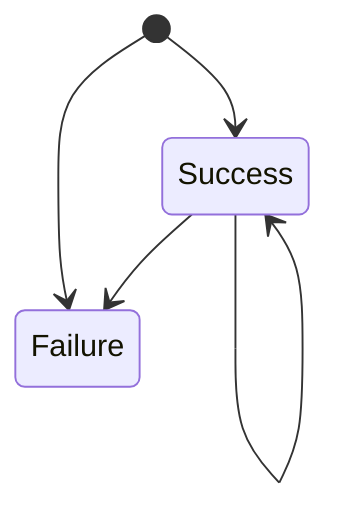

# Git DORA Report

Use the git history to generate a report of the DORA metrics.

## Assumptions

- Merge commits designate events that are used as data points.
- The existence of a specific tag (e.g. build-1234) on the merge commit indicates success.

## Data Collection

The script takes a local git repository as an input argument and traverses the log of that repository (optionally within a specified range)

The script uses a default data acquisition plugin but it’s possible to specify one to change the behavior.

The plugin must be a class that looks like this

```python
from dora_report.models import ChangeEvent

class MyDoraPlugin:
  def get_extra_arguments(self):
      """
      Return a list of ArgumentParser arguments to be added
      
      The arguments are added to the top level ArgumentParser
      at runtime to allow parsing. The arguments cannot 
      override/re-define existing ones but can be used to 
      customize the behavior of the plugin.
      """
      return [
         ...
      ]
 
  def validate_arguments(self, arguments):
      """
      Perform extra validation of arguments
      """
      ...

  def acquire_changes(self, arguments, since, until) -> List[ChangeEvent]:
      """
      Return changes as a generator
      
      :param arguments: All arguments parsed
      """
      ...
```

As default logic a workflow with pull requests and resulting merge commits is assumed and all merge commits are counted as changes.


### Acquire changes

### Change
A change follows the schema

id (String)
: A unique identifier for the change

stamp (Datetime)
: Timestamp of the event

success (boolean)
: `true` means the change was successful `false` indicates an error

lead_time (Timedelta)
: Time between work started and the change was registered in seconds

## States

When looking at changes they are categorized into being in one of three states visualized by the diagram.




### Success
If the merge commit has a tag that matches the pattern that was specified then the change was “successful”


### Failure
If the tag pattern specified does not match a tag on the merge commit it is considered a failure.


## Metrics
### Change Frequency

The interval argument is used as a basis for calculating the frequency.

The start and end of the interval are used to selects what changes are covered in that range.

The size of the interval (without the unit) decides it’s size.

E.g interval is set to “1d” (one day) - on that day 5 changes where made - thus the deployment frequency becomes 5/1 = 5.

On another day, only one change was registered and the frequency is 1

On the third, none was registered. The frequency is thus 0

For an interval of “1w” (one week), this then becomes (thursday: 1, friday: 0) (5 + 1 + 0 + 1 + 0)/7 = 7/7 = 1. If no further changes was made it would have been (5 + 1)/7 = 6/7 = 0,857.

### Change Failure Rate

The rate is computed the same way as change frequency however the basis of the computation is the number of deployments within the designated range. I.e

In a week where 7 changes where registered but one of them failed the change failure rate is 1/7 =0,143 

### Mean Time to Recover
Recovery means that the last change was a failure and the current one succeeded.

Recovery time is the difference between the failing and the succeeding change. E.g. on a single day changes where made

9:00: Failure
9:15: Success
11:15: Success
11:23: Failure
11:38: Success

Mean time to recover is the 9:15-9:00, 15 minutes and 11:38-11:23, minutes mean([15, 15])=15.0 minutes

The mean is calculated over all occurrences within the interval range (as a consequence the last change before the interval is used to determine if the first change is in a recovery state - if no prior changes exist, the state is assumed successful)


### Lead Time for Changes


## Report generation


## Code Guidelines
- Keep functions small
- Refactor existing logic when adding features
- Write appropriate log messages
- Use docstrings and PEP287 to explain functionality
- Inline document complicated code
- Lint using isort and in that order
- Use pytest
- Ensure test-suite passes for new changes
- Prefer using mocks, fixtures and fakers for conducting unit tests
- Exceptional conditions should be covered by unit tests
- main function should be covered by at least one integration/end-to-end test
- Prefer to use literal values when asserting during tests
- Use convential commits to format commit messages